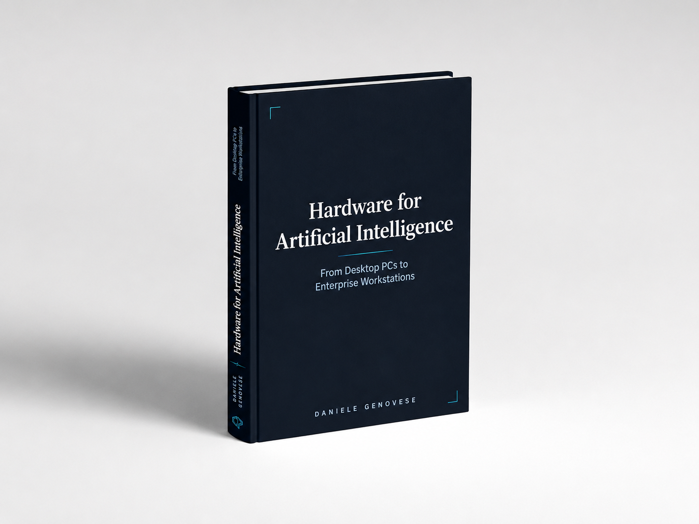
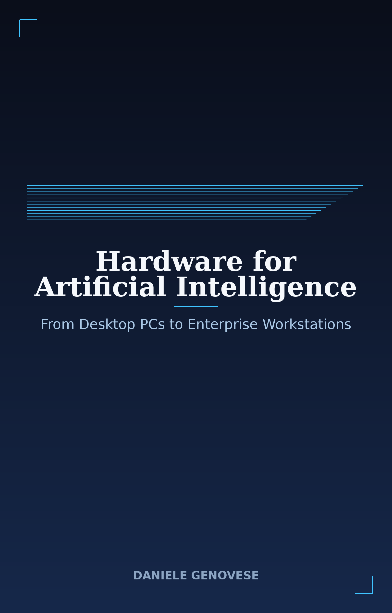
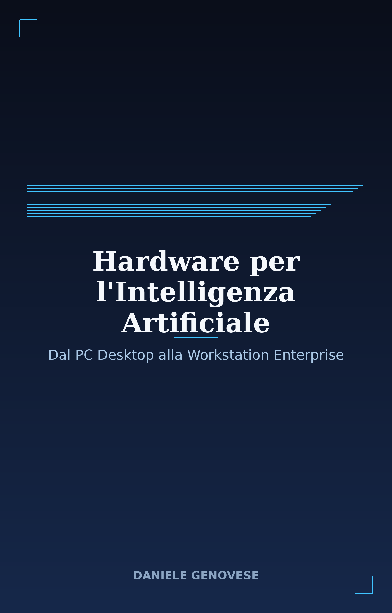

# Hardware for Artificial Intelligence
{: .no_toc }

### From Desktop PCs to Enterprise Workstations
{: .no_toc .text-delta }

A technical book on how a computer is actually built, from the desktop PC you
assemble at home to the multi-GPU workstation used to train artificial
intelligence models.

**12 chapters. ~380 pages. Free, in English and Italian.**
No sign-up, no email to hand over, no paywall.

---

## Download or read online

  

    
    <h3>English edition</h3>
    
<em>Hardware for Artificial Intelligence From Desktop PCs to Enterprise Workstations</em> 374 pages

    

      <a class="btn btn-primary" href="pdf/Hardware-for-Artificial-Intelligence-EN-v1.0.pdf">Download the PDF</a>
      <a class="btn" href="ENG/">Read online</a>
    

  

  

    
    <h3>Italian edition</h3>
    
<em>Hardware per l'Intelligenza Artificiale Dal PC Desktop alla Workstation Enterprise</em> 384 pages

    

      <a class="btn btn-primary" href="pdf/Hardware-per-l-Intelligenza-Artificiale-IT-v1.0.pdf">Download the PDF</a>
      <a class="btn" href="ITA/">Read online</a>
    

  

---

## What is inside

The first nine chapters start from zero and cover the desktop PC: CPU, motherboard,
RAM, GPU, storage, power supply, case and airflow, cooling, and a step-by-step
assembly chapter. The last three move up a tier, to where the conversation gets
expensive: HEDT and workstation CPUs, Nvidia GPUs from the workstation to the
datacenter, and how AMD Instinct compares against Nvidia for AI work.

| | |
|---|---|
| **1.** The CPU in Consumer Desktop PCs | **7.** The Case and Ventilation |
| **2.** The Motherboard | **8.** Cooling |
| **3.** RAM Memory | **9.** PC Assembly, Step by Step |
| **4.** The Graphics Card (Consumer GPU) | **10.** CPUs for AI Workstation and HEDT |
| **5.** Storage | **11.** Nvidia GPUs for AI |
| **6.** The Power Supply Unit (PSU) | **12.** AMD Instinct GPUs and the Nvidia comparison |

The approach is practical: comparison tables, price orders of magnitude, decision
checklists at the end of every chapter, and a fair amount of received wisdom taken
apart. It is not a shopping catalogue — it is the mental model for understanding
*why* a component costs what it costs, and when it is worth paying for.

Market data is current as of **July 2026**, including that year's DDR5 pricing
anomaly. Architectural concepts do not age; prices and product generations do —
check them at the time of purchase.

---

## Found a mistake?

The book has been fact-checked, but across 130,000 words of technical material
something always slips through. Known errors are listed in the
[errata](ERRATA.html).

If you find a new one — a typo, a wrong figure, an unclear explanation —
[open a report on GitHub](https://github.com/DanielePioGenovese/From-Desktop-PCs-to-Enterprise-Workstations/issues/new/choose).
There are three ready-made templates and it takes a minute.

---

## License

Released under [Creative Commons BY-NC-ND 4.0](https://creativecommons.org/licenses/by-nc-nd/4.0/).

You may download, read, print and redistribute it freely, including in a classroom
or inside a company, as long as you credit the author. You may not sell it or
publish modified versions.

*Daniele Genovese — 2026*
